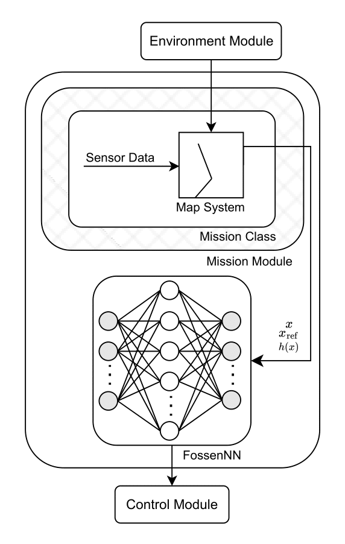

# AUV Control via Deep Imitation Learning

See implemented Dynamic and Kinematic Models [here](https://github.com/elymsyr/auv_control_system/blob/main/docs/DYNAMICS_README.md)...

This repository contains a complete pipeline for training a deep neural network to control an Autonomous Underwater Vehicle (AUV). The network learns to imitate the behavior of a computationally expensive nonlinear Model Predictive Controller (NL-MPC), enabling real-time, high-performance control.

The project demonstrates a successful workflow from data generation and preprocessing to model training, optimization, and evaluation, culminating in a model with **97.6% R²** performance on a challenging, unseen test set.



## Key Improvements & Results

This project underwent a systematic optimization process that dramatically improved performance from the initial baseline.

*   **Initial Problem:** The baseline model achieved a respectable 77.3% R² score but failed to learn the dynamics of specific thrusters, with R² scores as low as **0.25** for Thruster 3.
*   **Core Improvements:**
    1.  **Corrected Data Handling:** Implemented strict scenario-based splitting to eliminate data leakage between training and test sets, ensuring honest performance metrics.
    2.  **Intelligent Feature Engineering:** Reduced the reference trajectory input from 492 features to just 16. Instead of the full path, the model now receives 4 key future waypoints (`[x, y, z, yaw]`), making the input more concise and focused. This dramatically improved learning efficiency.
    3.  **Increased Model Capacity:** Enhanced the network architecture to better capture complex, non-linear dynamics.
    4.  **Robust Loss Function:** Switched from `MSELoss` to `HuberLoss` to make training less sensitive to outlier thruster commands.
*   **Final Result:** The optimized model achieves an overall **R² of 0.9762**, with even the weakest thrusters now performing excellently (e.g., Thruster 3 R² improved from 0.25 to **0.94**).

| Metric | fossen_net | **fossen_net_0** | **fossen_net_1** | **fossen_net_2** |
| :--- | :--- | :--- | :--- |
| **R² (Overall)** | 0.7735 | **0.9762** | **0.9908** | **0.9914** |
| Thruster 3 R² | 0.2516 | **0.9428** | **0.9781** | **0.9802** |
| Thruster 4 R² | 0.5913 | **0.9528** | **0.9839** | **0.9850** |
| Training Platform | Local | Local | **Amazon Sagemaker** | Local |
| Data Size | ~20m | ~180m | **~420m** | **~420m** |
| Input Size | 24 | 501 | 501 | 34 |

*   **Inputs:**
    *   **Current State (9 features):** The AUV's current state `[u, v, w, p, q, r, phi, theta, psi]` (velocities and orientations), excluding absolute world position.
    *   **Reference Trajectory (16 features):** A down-sampled, relative representation of the future path. Instead of the full 492-feature trajectory, the model is given 4 key future waypoints (from timesteps 10, 20, 30, and 40), each with 4 features (`[x, y, z, yaw]`). This provides crucial path information in a much more compact format.

*   **Detailed Architecture:**
    1.  **State Processing Branch:** A series of fully connected layers (`Linear(9, 64) -> Linear(64, 32)`) with `BatchNorm1d` for stable learning and `LeakyReLU` activation functions.
    2.  **Trajectory Processing Branch:** The 16 trajectory features are reshaped into a sequence of 4 timesteps (the 4 key waypoints) with 4 features each. A two-layer `LSTM` with a hidden size of 128 processes this sequence. The output from the final timestep is passed through a `Linear(128, 64)` layer.
    3.  **Combined Branch:** The outputs from the state and trajectory branches are concatenated. This combined feature vector is processed by a deeper series of `Linear` layers (`Linear(96, 256) -> Linear(256, 128) -> Linear(128, 64) -> Linear(64, 8)`) to produce the final 8 thruster commands. `BatchNorm1d` is used here as well.

## Repository Structure

-   **`control_test/`**: Legacy and experimental approaches for AUV control.
-   **`data/`**: Stores HDF5 datasets generated by the data generation process.
-   **`Model/`**:
    -   `train.ipynb`: The primary Jupyter Notebook for training the `FossenNet` model.
    -   `test/`: A C++ application for running high-performance inference using trained TorchScript models.

## FossenNet Architecture

`FossenNet` is a multi-branch neural network designed to process vehicle state and a reference trajectory to predict optimal thruster commands.

*   **Inputs:**
    *   **Current State (9 features):** The AUV's current state `[u, v, w, p, q, r, phi, theta, psi]` (velocities and orientations), excluding absolute world position.
    *   **Reference Trajectory (492 features):** The desired path over a future horizon, provided as 41 timesteps of 12 state features each. The path is pre-processed to be relative to the AUV's current position.

*   **Detailed Architecture:**
    1.  **State Processing Branch:** A series of fully connected layers (`Linear(9, 64) -> Linear(64, 32)`) with `BatchNorm1d` for stable learning and `LeakyReLU` activation functions.
    2.  **Trajectory Processing Branch:** A two-layer `LSTM` with a hidden size of 128 and internal dropout (0.2) processes the time-series trajectory. The output from the final timestep is passed through a `Linear(128, 64)` layer.
    3.  **Combined Branch:** The outputs from the state and trajectory branches are concatenated. This combined feature vector is processed by a deeper series of `Linear` layers (`Linear(96, 256) -> Linear(256, 128) -> Linear(128, 64) -> Linear(64, 8)`) to produce the final 8 thruster commands. `BatchNorm1d` is used here as well.

## Data Generation

The training dataset is generated by running the NL-MPC controller across a variety of scenarios.

*   **Dataset Schema:** Each data point includes the current state, the full reference path, and the optimal thruster command (`u_opt`) calculated by the NL-MPC.
*   **Format:** Data is stored in HDF5 format (`data.h5`).

### Cloud-Based Generation (AWS & Docker)

The data for this project was generated in the cloud to leverage powerful GPU resources.

*   **AWS Setup:**
    *   **EC2 Instance:** `g4dn.xlarge`
    *   **AMI:** Ubuntu 24.04 Deep Learning OSS AMI
*   **Docker Container:** A public Docker image contains the data generation environment.

To replicate the data generation process:

1.  Pull the Docker image:
    ```sh
    docker pull elymsyr/auv_generate
    ```
2.  Run the container with GPU access:
    ```sh
    docker run --gpus all -it elymsyr/auv_generate
    ```
3.  Once the process completes, copy the data from the container to your host machine:
    ```sh
    docker cp <container_id>:/app/build/data.h5 <your_local_path>/data.h5
    ```

## Training & Usage

1.  **Prepare Data:** Generate the dataset using the Docker instructions above or your own method.

2.  **Train the Model:** Open and run the `Model/train.ipynb` notebook. The notebook handles:
    *   **Preprocessing:** Loading data and applying `StandardScaler` normalization (fit *only* on the training set). Crucially, it performs **scenario-aware splitting** to prevent data leakage.
    *   **Training:** Implements the `FossenNet` model and a training loop using `HuberLoss`, the `Adam` optimizer, and a `ReduceLROnPlateau` learning rate scheduler.
    *   **Evaluation:** Provides detailed metrics (R², MAE, MSE) and visualizations to assess model performance on the test set.

3.  **Saving Models for Deployment:**
    *   During training, the best model weights are saved to `best_model_huber_adam.pth` whenever validation loss improves. This file should be used for analysis and further Python-based work.
    *   For deployment, first load the state dictionary from the `.pth` file into the model, then create a TorchScript version:
        ```python
        # Load best weights
        model = FossenNet()
        model.load_state_dict(torch.load('best_model_huber_adam.pth'))
        model.eval()

        # Create and save scripted model for deployment
        scripted_model = torch.jit.script(model)
        scripted_model.save('fossen_net_scripted_BEST.pt')
        ```

4.  **Real-Time Inference:** Use the C++ application in `Model/test/` with the generated `fossen_net_scripted_BEST.pt` file for real-time, low-latency control.

## Requirements

-   Python 3.11
-   PyTorch
-   scikit-learn
-   h5py
-   matplotlib
-   numpy
-   Docker (for data generation)

## Security Notice

⚠️ **This module is a research project and is not production-ready.**
There may be untested features or incomplete security measures.
**Do not use this system in safety-critical or live operational environments.**
